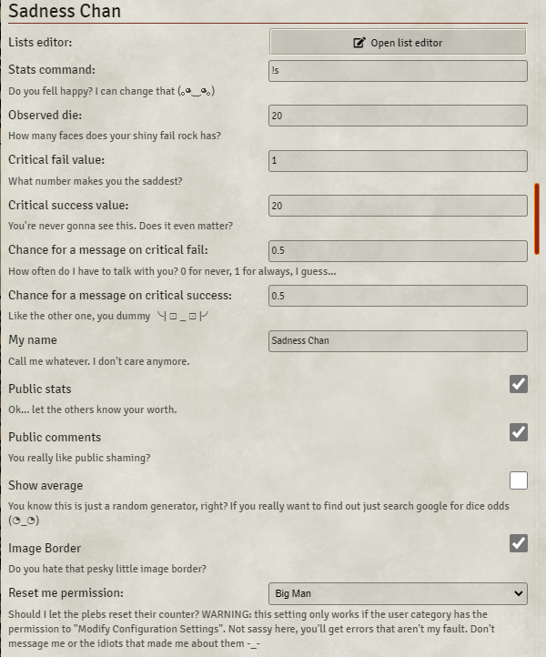
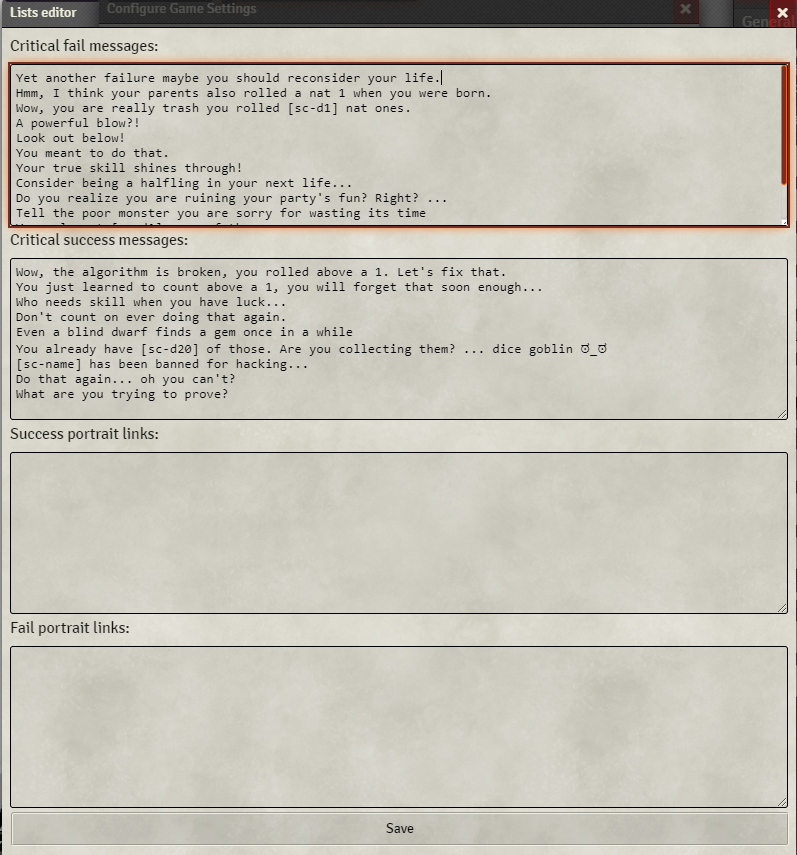

# Sadness Chan


[](https://forge-vtt.com/bazaar#package=sadness-chan)


[](https://www.foundryvtt-hub.com/package/sadness-chan/)


[](https://weblate.foundryvtt-hub.com/engage/sadness-chan/)

### If you want to buy me a coffee [](https://www.patreon.com/p4535992)


A chat 'bot' for FoundryVTT that's full of 'happy' and 'motivational' messages, to pick you up when your rolls let you down.

# Usage
Just play as you would usually do and Sadness Chan will send you 'happy' whispers if anything noteworthy happens.

But if you need more help just type `!sadness help` in the chat, and I will give you some more instructions.

### In case you are too special for any of my default settings, you can just change them, I guess...



### You can also modify all my 'cute' messages if any of them are too spicy for you `¯\_(ツ)_/¯`




Available templates:
- `[sc-name]`: name of the user that made the roll
- `[sc-avg]`: average rolled value by the user, rounded up to the nearest integer.
- `[sc-d<x>]`: number of rolled `<x>`. For example, `[sc-d20]` is the number of natural 20s, while `[sc-d1]` is the number of natural 1s.

**Disclaimer:** This module is a joke, and should be treated as such.


## NOTE: This module is under maintenance, I have no plans to update or add features. However, I will try to fix any bugs as possible. Any contribution is welcome.

## Installation

It's always easiest to install modules from the in game add-on browser.

To install this module manually:
1.  Inside the Foundry "Configuration and Setup" screen, click "Add-on Modules"
2.  Click "Install Module"
3.  In the "Manifest URL" field, paste the following url:
`https://raw.githubusercontent.com/p4535992/foundryvtt-sadness-chan/master/src/module.json`
4.  Click 'Install' and wait for installation to complete
5.  Don't forget to enable the module in game using the "Manage Module" button


# Build

## Install all packages

```bash
npm install
```

### dev

`dev` will let you develop you own code with hot reloading on the browser

```bash
npm run dev
```

### build

`build` will build and set up a symlink between `dist` and your `dataPath`.

```bash
npm run build
```

### build:watch

`build:watch` will build and watch for changes, rebuilding automatically.

```bash
npm run build:watch
```

### prettier-format

`prettier-format` launch the prettier plugin based on the configuration [here](./.prettierrc)

```bash
npm run-script prettier-format
```

### lint

`lint` launch the eslint process based on the configuration [here](./.eslintrc.json)

```bash
npm run-script lint
```

### lint:fix

`lint:fix` launch the eslint process with the fix argument

```bash
npm run-script lint:fix
```

## [Changelog](./changelog.md)

## Issues

Any issues, bugs, or feature requests are always welcome to be reported directly to the [Issue Tracker](https://github.com/p4535992/foundryvtt-sadness-chan/issues ), or using the [Bug Reporter Module](https://foundryvtt.com/packages/bug-reporter/).

## License


This package is under an [MIT license](LICENSE) and the [Foundry Virtual Tabletop Limited License Agreement for module development](https://foundryvtt.com/article/license/).


